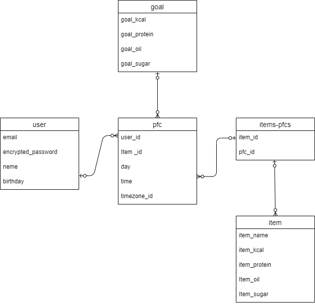
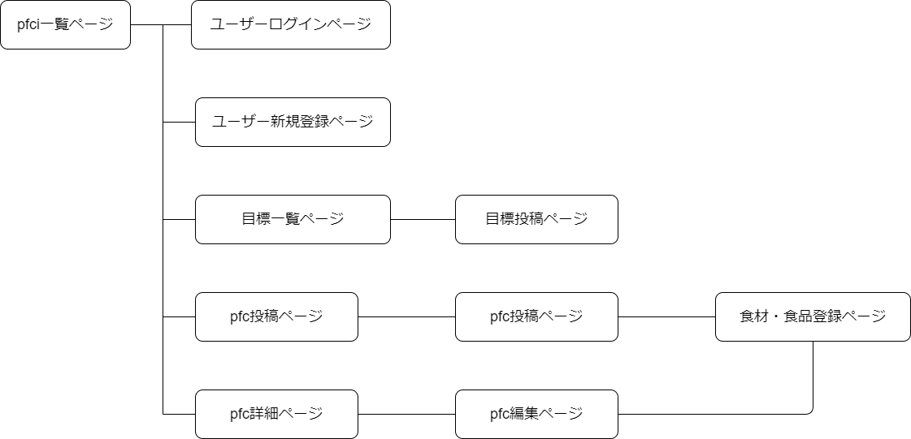

# アプリケーション名

yuor-pfc

# アプリケーション概要

日々の食事の内容を記録し把握して、健康的なまたはダイエットに向いた食事を管理するアプリ

# テスト用アカウント

- メールアドレス:aaa@gmail.com
- パスワード:aaaaaa

# 利用方法

## 目標設定

1.トップページのヘッダーからユーザーの新規登録を行う
2.トップページより目標ページに移動する
3.目標ボタンから、１日の摂取する栄養（kcal,タンパク質,糖質,脂質）とダイエット方法（任意）決め目標ボタンより投稿を行う
4.目標一覧ページに投稿された目標から１つ選び★ボタンを押すことでトップページに反映されて１日に摂取する目標を確定する

## 食べた食事の管理

1.トップページより登録ボタンを押して、食べた食事の内容と時間を記録をする
2.記録する際に登録がない食材や食品、料理がない場合は食材登録ボタンにて登録を行う
3.投稿後トップページに食事の内容等が表示され、目標との比較が表示される

# アプリケーションを作成した背景

自身のダイエット経験から着想を得て作成に取り掛かりました。
120㎏から体重を75㎏まで落とす際にトレーニングも必要ですがそれ以上に食事の内容がとても重要だと知りました。
他にも多くの食事管理アプリはありますが初心者向のものが多く自身で、目標の設定やkcalの細かな設定が出来ないものが多いと感じ自身で開発することにしました。

# 洗う出した要件
https://docs.google.com/spreadsheets/d/1Ciq_WcrBKKtFXo-ZqkwWbk3HFpdZ3JtbmTfzgR3cJmc/edit?gid=982722306#gid=982722306

# 実装した機能についての画像やGIF及びその説明

# 実装予定の機能

- 体重記録機能
- トレーニング管理機能
- 食事レシピの投稿機能

# データベース設定

# 画面遷移図

# 開発環境
- フロントエンド
- バックエンド
- インフラ
- テスト

# ローカルでの動作方法

%git clone https://github.com/morikentarou/yuo-pfc

%cd you-pfc

%bundle install

# 工夫したポイント

目標と投稿した食事の内容をグラフを活用して比較することでアプリを開いてすぐに現在の
状況を確認できるようにしています。
また、目標設定では自身で目標の数字を細かに設定できるだけでなく、kcalを入力しダイエットプランを選択すれば自動で残りの栄養素の摂取量の振り分けが表示されます。

